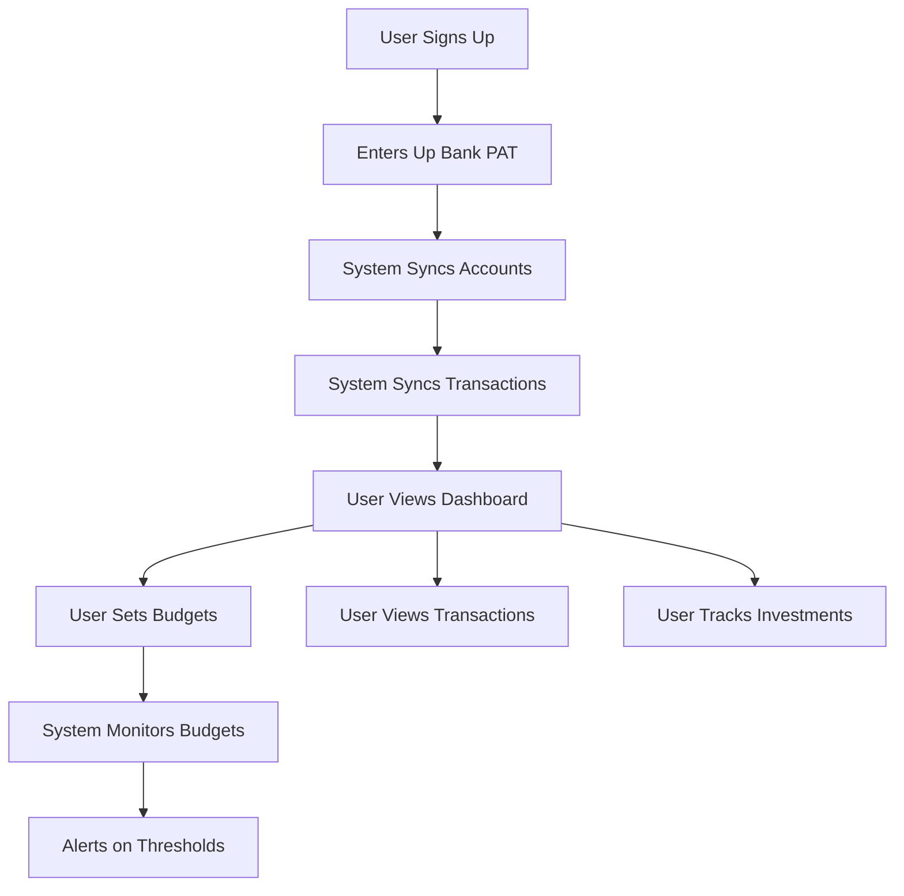

# Technical Architecture Overview
## Vantura PWA - Budgeting & Investment Tracker

**Document Version:** 1.0  
**Last Updated:** December 2025  
**Project:** Vantura PWA Application

---

## Table of Contents

1. [Executive Summary](#executive-summary)
2. [System Overview](#system-overview)
3. [High-Level Architecture](#high-level-architecture)
4. [Technology Stack](#technology-stack)
5. [Deployment Architecture](#deployment-architecture)
6. [System Requirements](#system-requirements)
7. [Architecture Principles](#architecture-principles)

---

## Executive Summary

This document outlines the technical architecture for a Progressive Web Application (PWA) that provides desktop access to Up Bank account data with integrated budgeting and investment tracking capabilities.

### Key Characteristics

- **Type:** Multi-user web application with PWA capabilities
- **Backend:** Ruby on Rails 8.1.1+ with PostgreSQL
- **Frontend:** Hotwire (Turbo + Stimulus) with Tailwind CSS
- **Hosting:** Render cloud platform
- **Authentication:** Devise-based multi-user system
- **Data Source:** Up Bank API (read-only)
- **Scale:** Initial ~5 users, ~3,000 transactions per user

### Core Capabilities

1. **Account Management:** View Up Bank accounts (transactional, saver, home loan)
2. **Transaction History:** Browse and filter 12 months of transaction data
3. **Budgeting:** Category-based budget tracking with alerts
4. **Investment Tracking:** Monitor savings growth and investment-related transactions
5. **Real-time Updates:** Manual refresh with optional background sync

---

## System Overview

### Application Purpose

Up Bank currently only provides a native mobile app. This application extends access to desktop/web platforms while adding budgeting and investment tracking features not available in the native app.

### User Workflow



### Data Flow Overview

1. **User Registration:** User creates account via Devise
2. **PAT Configuration:** User provides Up Bank Personal Access Token
3. **Initial Sync:** Background job fetches accounts and transactions
4. **Ongoing Sync:** Periodic background jobs update transaction data
5. **User Interaction:** Hotwire/Turbo provides seamless UI updates
6. **Budgeting:** System calculates spending against category budgets
7. **Investment Tracking:** System monitors savings and investment transactions

---

## High-Level Architecture

### Three-Tier Architecture

```
┌─────────────────────────────────────────────────────────┐
│                    Presentation Layer                   │
│  Hotwire (Turbo + Stimulus) + Tailwind CSS + Flowbite   │
│              Progressive Web App (PWA)                  │
└───────────────────────┬─────────────────────────────────┘
                        │
                        │ HTTP/HTTPS
                        │
┌───────────────────────▼─────────────────────────────────┐
│                  Application Layer                      │
│              Ruby on Rails Application                  │
│  ┌──────────┐  ┌──────────┐  ┌──────────┐               │
│  Controllers   │  Models  │  │  Jobs    │               │
│  └──────────┘  └──────────┘  └──────────┘               │
│  ┌──────────┐  ┌──────────┐  ┌──────────┐               │
│  │ Services │  │  Helpers │  │  Mailers │               │
│  └──────────┘  └──────────┘  └──────────┘               │
└───────────────────────┬─────────────────────────────────┘
                        │
                        │ ActiveRecord
                        │
┌───────────────────────▼─────────────────────────────────┐
│                    Data Layer                           │
│              PostgreSQL Database                        │
│  ┌──────────┐  ┌──────────┐  ┌──────────┐               │
│  │  Users   │  │Accounts  │  Transactions               │
│  └──────────┘  └──────────┘  └──────────┘               │
│  ┌──────────┐  ┌──────────┐  ┌──────────┐               │
│  │ Budgets  │  │Categories│  │  Tags    │               │
│  └──────────┘  └──────────┘  └──────────┘               │
└─────────────────────────────────────────────────────────┘
                        │
                        │ HTTPS API Calls
                        │
┌───────────────────────▼─────────────────────────────────┐
│                  External Services                      │
│              Up Bank API (api.up.com.au)                │
└─────────────────────────────────────────────────────────┘
```

### Component Breakdown

#### Frontend Components

- **Turbo Frames:** Partial page updates without full reload
- **Turbo Streams:** Real-time updates (future enhancement)
- **Stimulus Controllers:** Interactive JavaScript behavior
- **Tailwind CSS:** Utility-first styling
- **Flowbite:** Pre-built UI components
- **Service Worker:** PWA offline capabilities (optional initially)

#### Backend Components

- **Rails Controllers:** Handle HTTP requests and responses
- **ActiveRecord Models:** Database interactions and business logic
- **Background Jobs:** Transaction syncing, budget calculations
- **Services:** Up API integration, data processing
- **Mailers:** User notifications (budget alerts, etc.)

#### Data Components

- **PostgreSQL Tables:** Users, accounts, transactions, budgets, etc.
- **Encrypted Storage:** PAT tokens stored securely
- **Indexes:** Optimized queries for transaction filtering

---

## Technology Stack

### Backend Stack

| Component | Technology | Version | Purpose |
|-----------|-----------|---------|---------|
| **Framework** | Ruby on Rails | 8.1.1 | Full-stack web framework |
| **Language** | Ruby | 3.4.8+ | Application language |
| **Database** | PostgreSQL | 14+ | Primary data store |
| **Authentication** | Devise | Latest | User authentication |
| **Background Jobs** | ActiveJob + Solid Queue | Rails 8 | Async processing (uses PostgreSQL) |
| **HTTP Client** | Faraday | Latest | Up API integration |
| **Encryption** | ActiveRecord Encryption | Built-in Rails 8.1.1+ | PAT encryption (AES-256-GCM) |

### Frontend Stack

| Component | Technology | Version | Purpose |
|-----------|-----------|---------|---------|
| **Framework** | Hotwire | Latest | Modern web framework |
| **Turbo** | Turbo Rails | Latest | SPA-like navigation |
| **Stimulus** | Stimulus.js | Latest | JavaScript framework |
| **Styling** | Tailwind CSS | 4.1+ | Utility-first CSS |
| **Components** | Flowbite | 4.0+ | UI component library |
| **Icons** | Heroicons | Latest | Icon library |
| **Charts** | Chart.js | Latest | Data visualization |

### Infrastructure Stack

| Component | Technology | Purpose |
|-----------|-----------|---------|
| **Hosting** | Render | Application hosting |
| **Database** | Render PostgreSQL | Managed database |
| **Background Jobs** | Render Background Workers | Job processing |
| **SSL/TLS** | Render (Automatic) | HTTPS encryption |
| **CDN** | Render (Optional) | Static asset delivery |

### Development Tools

| Component | Technology | Purpose |
|-----------|-----------|---------|
| **Version Control** | Git | Source control |
| **Testing** | RSpec | Backend testing |
| **Testing** | Capybara | Integration testing |
| **Linting** | RuboCop | Code quality |
| **Asset Pipeline** | Propshaft | Asset management |

---

## Deployment Architecture

### Render Deployment Structure

```
┌─────────────────────────────────────────────────────────┐
│                    Render Platform                      │
│                                                         │
│  ┌──────────────────────────────────────────────────┐   │
│  │         Web Service (Rails App)                  │   │
│  │  - Handles HTTP requests                         │   │
│  │  - Serves Hotwire/Turbo responses                │   │
│  │  - Public URL: *.onrender.com                    │   │
│  └──────────────────────────────────────────────────┘   │
│                          │                              │
│                          │ Connects to                  │
│                          ▼                              │
│  ┌──────────────────────────────────────────────────┐   │
│  │      PostgreSQL Database (Managed)               │   │
│  │  - Stores all application data                   │   │
│  │  - Encrypted PAT storage                         │   │
│  │  - Automatic backups                             │   │
│  └──────────────────────────────────────────────────┘   │
│                          │                              │
│                          │ Used by                      │
│                          ▼                              │
│  ┌──────────────────────────────────────────────────┐   │
│  │    Background Worker (Solid Queue)               │   │
│  │  - Transaction syncing                           │   │
│  │  - Budget calculations                           │   │
│  │  - Periodic data updates                         │   │
│  └──────────────────────────────────────────────────┘   │
└─────────────────────────────────────────────────────────┘
                          │
                          │ HTTPS API Calls
                          ▼
┌─────────────────────────────────────────────────────────┐
│              Up Bank API (External)                     │
│              https://api.up.com.au/api/v1/              │
└─────────────────────────────────────────────────────────┘
```

### Environment Configuration

#### Production (Render)

- **Web Service:** Auto-deploys from Git main branch
- **Database:** Managed PostgreSQL with automatic backups
- **Background Workers:** Separate service for job processing
- **Environment Variables:** Configured via Render dashboard
- **SSL:** Automatic HTTPS via Render

#### Development (Local)

- **Database:** Local PostgreSQL instance
- **Background Jobs:** Inline processing or local Solid Queue
- **Environment:** `.env` file for local configuration
- **HTTPS:** Optional (localhost for development)

---

## System Requirements

### Performance Requirements

- **Initial Load:** < 2 seconds for dashboard
- **Transaction List:** < 1 second for 12 months of data
- **API Sync:** Background job completes within 5 minutes for initial sync
- **Concurrent Users:** Support 5+ simultaneous users
- **Database Queries:** Optimized with proper indexes

### Scalability Considerations

**Initial Scale:**
- ~5 users
- ~3,000 transactions per user
- ~15,000 total transactions
- ~47 categories per user
- ~10-20 budgets per user

**Future Scale (if needed):**
- Database indexing supports 100,000+ transactions
- Background job queue handles increased load
- Render auto-scaling available if needed

### Data Retention

- **Display:** Last 12 months of transactions by default
- **Storage:** All transactions stored in database (no automatic deletion)
- **User Control:** Users can delete their own data
- **Backup:** Render automatic database backups

---

## Architecture Principles

### 1. Security First

- All PAT tokens encrypted at rest
- HTTPS required for all connections
- Rails standard security practices
- Input validation and sanitization
- SQL injection prevention (ActiveRecord)

### 2. User Privacy

- Each user's data isolated by user_id
- PAT tokens never exposed to frontend
- Encrypted storage for sensitive data
- User can delete account and all data

### 3. Performance

- Database indexes on frequently queried fields
- Background jobs for heavy operations
- Efficient API pagination handling
- Minimal frontend JavaScript (Stimulus only)

### 4. Maintainability

- Standard Rails conventions
- Service objects for complex logic
- Clear separation of concerns
- Comprehensive test coverage

### 5. Progressive Enhancement

- Works without JavaScript (Turbo enhances)
- PWA features optional (works as regular web app)
- Graceful degradation for older browsers
- Mobile-responsive design

### 6. API Integration Best Practices

- Rate limit handling with exponential backoff
- Proper error handling and retries
- Efficient pagination processing
- Webhook support (future enhancement)

---

**Document Version:** 1.0  
**Last Updated:** December 2025

