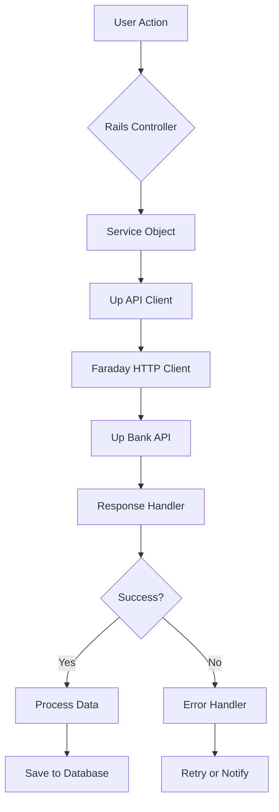
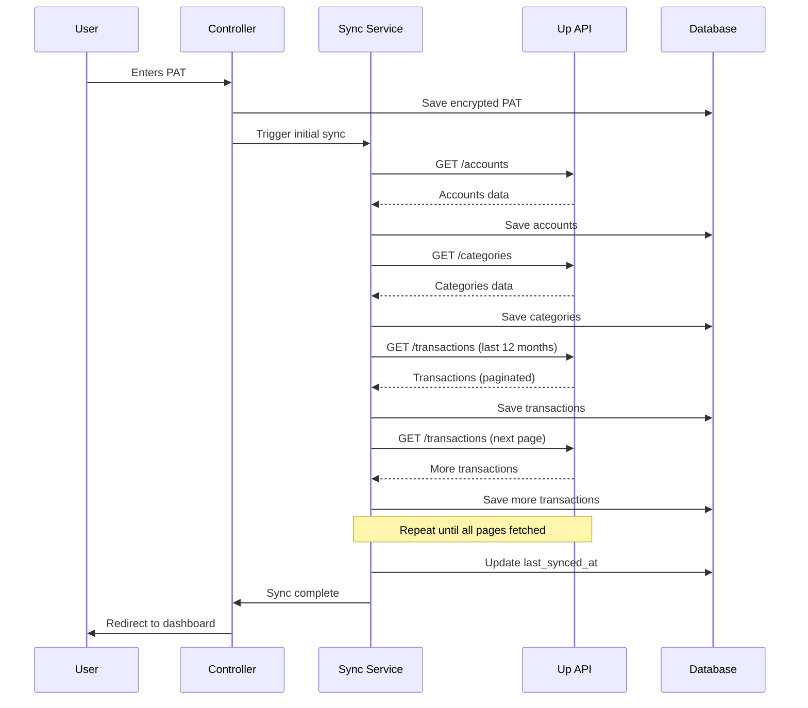
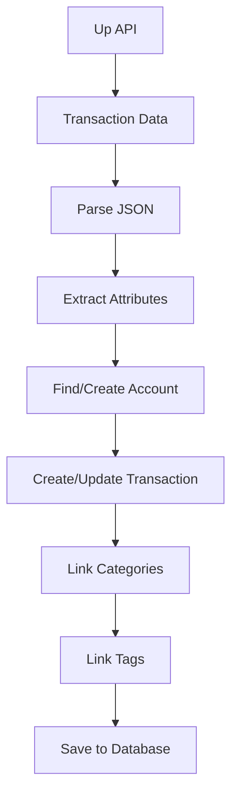
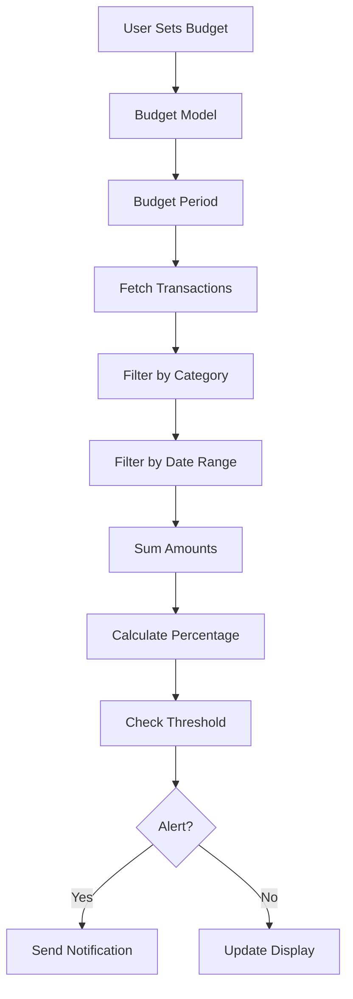
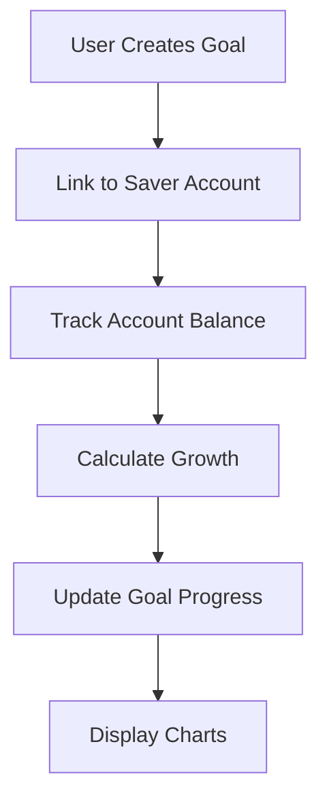

# Data Flow & Integration
## Up API Integration & Data Synchronization

**Document Version:** 1.0  
**Last Updated:** December 2025  
**Related:** [Backend Architecture](./02-backend-architecture.md)

---

## Table of Contents

1. [Up API Integration Overview](#up-api-integration-overview)
2. [Initial Data Synchronization](#initial-data-synchronization)
3. [Ongoing Data Synchronization](#ongoing-data-synchronization)
4. [Transaction Processing](#transaction-processing)
5. [Budgeting Engine](#budgeting-engine)
6. [Investment Tracking](#investment-tracking)
7. [Error Handling & Retry Logic](#error-handling--retry-logic)
8. [Rate Limiting Management](#rate-limiting-management)

---

## Up API Integration Overview

### API Client Architecture



### API Endpoints Used

| Endpoint | Purpose | Frequency |
|----------|---------|-----------|
| `GET /accounts` | Fetch user accounts | Initial sync, periodic updates |
| `GET /accounts/{id}` | Get specific account | On-demand |
| `GET /transactions` | Fetch transactions | Initial sync, periodic updates |
| `GET /transactions/{id}` | Get specific transaction | On-demand |
| `GET /categories` | Fetch category hierarchy | One-time sync |
| `GET /categories/{id}` | Get specific category | On-demand |
| `GET /util/ping` | Health check | Periodic validation |

### Authentication Flow

```ruby
# Each API request includes encrypted PAT
def build_connection
  Faraday.new(url: BASE_URL) do |conn|
    conn.headers['Authorization'] = "Bearer #{decrypted_pat}"
    conn.headers['Content-Type'] = 'application/json'
  end
end
```

---

## Initial Data Synchronization

### User Onboarding Flow



### Initial Sync Service

```ruby
# app/services/initial_sync_service.rb
class InitialSyncService
  def initialize(user)
    @user = user
    @client = UpApi::Client.new(user.up_pat)
  end

  def perform
    Rails.logger.info "Starting initial sync for user #{@user.id}"

    # Step 1: Sync accounts
    sync_accounts

    # Step 2: Sync categories (if not already synced)
    sync_categories unless Category.exists?

    # Step 3: Sync transactions (last 12 months)
    sync_transactions

    # Step 4: Update sync timestamp
    @user.update(last_synced_at: Time.current)

    Rails.logger.info "Initial sync complete for user #{@user.id}"
  rescue UpApi::AuthenticationError => e
    Rails.logger.error "Authentication failed: #{e.message}"
    raise
  rescue UpApi::ApiError => e
    Rails.logger.error "API error during sync: #{e.message}"
    raise
  end

  private

  def sync_accounts
    UpApi::AccountsSync.new(@user).sync
  end

  def sync_categories
    UpApi::CategoriesSync.new.sync
  end

  def sync_transactions
    since_date = 12.months.ago
    UpApi::TransactionsSync.new(@user).sync_all(since: since_date)
  end
end
```

### Background Job for Initial Sync

```ruby
# app/jobs/initial_sync_job.rb
class InitialSyncJob < ApplicationJob
  queue_as :default

  retry_on UpApi::RateLimitError, wait: :exponentially_longer, attempts: 5
  retry_on UpApi::ApiError, wait: 5.seconds, attempts: 3

  def perform(user_id)
    user = User.find(user_id)
    return unless user.up_pat_configured?

    InitialSyncService.new(user).perform
  rescue UpApi::AuthenticationError => e
    Rails.logger.error "Authentication failed for user #{user_id}"
    # Notify user via email
    UserMailer.sync_failed(user, e.message).deliver_later
  end
end
```

---

## Ongoing Data Synchronization

### Periodic Sync Strategy

```ruby
# config/schedule.rb (if using whenever gem)
every 1.hour do
  runner "SyncAllUsersJob.perform_later"
end

every 1.day, at: '2:00 am' do
  runner "FullSyncAllUsersJob.perform_later"
end
```

### Incremental Sync Service

```ruby
# app/services/incremental_sync_service.rb
class IncrementalSyncService
  def initialize(user)
    @user = user
    @client = UpApi::Client.new(@user.up_pat)
  end

  def perform
    # Only sync new/updated transactions since last sync
    last_sync = @user.last_synced_at || 1.hour.ago
    
    # Sync accounts (balance updates)
    sync_accounts

    # Sync new transactions
    sync_new_transactions(since: last_sync)

    @user.update(last_synced_at: Time.current)
  end

  private

  def sync_accounts
    UpApi::AccountsSync.new(@user).sync
  end

  def sync_new_transactions(since:)
    UpApi::TransactionsSync.new(@user).sync_all(since: since)
  end
end
```

### Sync All Users Job

```ruby
# app/jobs/sync_all_users_job.rb
class SyncAllUsersJob < ApplicationJob
  queue_as :default

  def perform
    User.where.not(up_pat_ciphertext: nil).find_each do |user|
      if user.sync_required?
        IncrementalSyncService.new(user).perform
      end
    end
  end
end
```

---

## Transaction Processing

### Transaction Data Flow



### Transaction Sync Implementation

```ruby
# app/services/up_api/transactions_sync.rb (detailed)
module UpApi
  class TransactionsSync
    def initialize(user, account = nil)
      @user = user
      @account = account
      @client = Client.new(user.up_pat)
      @synced_count = 0
      @updated_count = 0
      @created_count = 0
    end

    def sync_all(since: nil, until_date: nil)
      since ||= determine_since_date
      
      params = build_params(since, until_date)
      sync_with_pagination(params)
      
      {
        synced: @synced_count,
        created: @created_count,
        updated: @updated_count
      }
    end

    private

    def determine_since_date
      # Get most recent transaction date, or default to 12 months ago
      most_recent = @user.transactions.maximum(:up_created_at)
      most_recent || 12.months.ago
    end

    def build_params(since, until_date)
      params = {
        'filter[since]' => since.iso8601,
        'page[size]' => 100  # Maximum page size
      }
      params['filter[until]'] = until_date.iso8601 if until_date
      params
    end

    def sync_with_pagination(params)
      next_cursor = nil
      
      loop do
        params['page[after]'] = next_cursor if next_cursor
        
        response = fetch_page(params)
        break unless response
        
        process_page(response)
        
        next_cursor = extract_next_cursor(response)
        break unless next_cursor
        
        # Rate limit protection
        sleep(0.5) if @synced_count % 100 == 0
      end
    end

    def fetch_page(params)
      @client.transactions(params)
    rescue UpApi::RateLimitError => e
      handle_rate_limit(e)
      retry
    end

    def process_page(response)
      transactions_data = response['data'] || []
      
      transactions_data.each do |transaction_data|
        process_transaction(transaction_data)
        @synced_count += 1
      end
    end

    def process_transaction(transaction_data)
      up_id = transaction_data['id']
      transaction = @user.transactions.find_or_initialize_by(up_id: up_id)
      
      was_new = transaction.new_record?
      
      update_transaction_attributes(transaction, transaction_data)
      transaction.save!
      
      if was_new
        @created_count += 1
      else
        @updated_count += 1
      end
      
      sync_transaction_relationships(transaction, transaction_data)
    end

    def update_transaction_attributes(transaction, data)
      attributes = data['attributes']
      relationships = data['relationships']
      
      # Find account
      account_up_id = relationships.dig('account', 'data', 'id')
      account = @account || @user.accounts.find_by!(up_id: account_up_id)
      
      # Parse money amount (Up API returns in base units, divide by 100)
      amount_data = attributes['amount']
      amount = amount_data['valueInBaseUnits'].to_f / 100.0
      
      # Update attributes
      transaction.assign_attributes(
        account: account,
        status: attributes['status'],
        raw_text: attributes['rawText'],
        description: attributes['description'],
        message: attributes['message'],
        hold_info_is_cover: attributes.dig('holdInfo', 'isCover') || false,
        amount: amount,
        currency_code: amount_data['currencyCode'],
        foreign_amount: attributes.dig('foreignAmount', 'valueInBaseUnits'),
        foreign_currency_code: attributes.dig('foreignAmount', 'currencyCode'),
        settled_at: parse_datetime(attributes['settledAt']),
        up_created_at: parse_datetime(attributes['createdAt'])
      )
    end

    def sync_transaction_relationships(transaction, data)
      relationships = data['relationships']
      
      # Sync categories
      category_data = relationships['category']
      if category_data && category_data['data']
        category_up_id = category_data['data']['id']
        category = Category.find_by(up_id: category_up_id)
        if category
          transaction.transaction_categories.find_or_create_by(category: category)
        end
      end
      
      # Sync tags
      tags_data = relationships['tags']
      if tags_data && tags_data['data']
        tags_data['data'].each do |tag_data|
          tag_name = tag_data['id']  # Up API uses tag name as ID
          tag = @user.tags.find_or_create_by(name: tag_name)
          transaction.transaction_tags.find_or_create_by(tag: tag)
        end
      end
    end

    def parse_datetime(datetime_string)
      return nil unless datetime_string
      Time.parse(datetime_string)
    rescue ArgumentError
      nil
    end

    def extract_next_cursor(response)
      links = response['links'] || {}
      next_url = links['next']
      return nil unless next_url
      
      uri = URI.parse(next_url)
      params = URI.decode_www_form(uri.query || '').to_h
      params['page[after]']
    end

    def handle_rate_limit(error)
      Rails.logger.warn "Rate limit hit, waiting 60 seconds..."
      sleep(60)
    end
  end
end
```

---

## Budgeting Engine

### Budget Calculation Flow



### Budget Calculator Service

```ruby
# app/services/budget_calculator.rb (detailed)
class BudgetCalculator
  def initialize(user)
    @user = user
  end

  def calculate_for_period(budget, date = Date.current)
    period_start = calculate_period_start(budget.period, date)
    period_end = calculate_period_end(budget.period, date)
    
    transactions = fetch_budget_transactions(budget, period_start, period_end)
    spent = calculate_spent(transactions)
    
    {
      budget: budget,
      period_start: period_start,
      period_end: period_end,
      limit: budget.amount,
      spent: spent,
      remaining: budget.amount - spent,
      percentage: calculate_percentage(spent, budget.amount),
      alert_threshold: budget.alert_threshold,
      alert_triggered: spent >= (budget.amount * budget.alert_threshold / 100),
      transactions_count: transactions.count
    }
  end

  def calculate_all_for_period(date = Date.current)
    @user.budgets.active.map do |budget|
      calculate_for_period(budget, date)
    end
  end

  def calculate_spending_by_category(date = Date.current)
    period_start = date.beginning_of_month
    period_end = date.end_of_month
    
    @user.transactions
      .settled
      .where(settled_at: period_start..period_end)
      .joins(:categories)
      .group('categories.id', 'categories.name')
      .sum('ABS(transactions.amount)')
      .map do |(category_id, category_name), amount|
        {
          category_id: category_id,
          category_name: category_name,
          amount: amount
        }
      end
  end

  private

  def fetch_budget_transactions(budget, start_date, end_date)
    transactions = @user.transactions
      .settled
      .where(settled_at: start_date..end_date)
    
    if budget.category_id
      transactions = transactions.by_category(budget.category_id)
    end
    
    transactions
  end

  def calculate_spent(transactions)
    # Sum absolute values of debit transactions
    transactions.sum { |t| t.amount.abs }
  end

  def calculate_percentage(spent, limit)
    return 0 if limit.zero?
    (spent / limit * 100).round(2)
  end

  def calculate_period_start(period, date)
    case period
    when 'monthly' then date.beginning_of_month
    when 'weekly' then date.beginning_of_week
    when 'yearly' then date.beginning_of_year
    else date.beginning_of_month
    end
  end

  def calculate_period_end(period, date)
    case period
    when 'monthly' then date.end_of_month
    when 'weekly' then date.end_of_week
    when 'yearly' then date.end_of_year
    else date.end_of_month
    end
  end
end
```

### Budget Alert System

```ruby
# app/jobs/check_budget_alerts_job.rb
class CheckBudgetAlertsJob < ApplicationJob
  queue_as :default

  def perform(user_id)
    user = User.find(user_id)
    calculator = BudgetCalculator.new(user)
    
    user.budgets.active.each do |budget|
      calculation = calculator.calculate_for_period(budget)
      
      if calculation[:alert_triggered]
        # Check if we've already sent an alert for this period
        last_alert = user.budget_alerts
          .where(budget_id: budget.id)
          .where('created_at >= ?', calculation[:period_start])
          .order(created_at: :desc)
          .first
        
        unless last_alert
          send_budget_alert(user, budget, calculation)
        end
      end
    end
  end

  private

  def send_budget_alert(user, budget, calculation)
    BudgetAlertMailer.threshold_reached(user, budget, calculation).deliver_later
    
    # Create alert record
    user.budget_alerts.create!(
      budget: budget,
      spent: calculation[:spent],
      limit: calculation[:limit],
      percentage: calculation[:percentage]
    )
  end
end
```

---

## Investment Tracking

### Investment Tracking Flow



### Investment Tracker Service

```ruby
# app/services/investment_tracker.rb (detailed)
class InvestmentTracker
  def initialize(user)
    @user = user
  end

  def track_savings_growth(account, months: 12)
    end_date = Date.current
    start_date = months.months.ago
    
    # Get all transactions in period
    transactions = account.transactions
      .settled
      .where('settled_at >= ?', start_date)
      .order(:settled_at)
    
    # Calculate balance history
    balance_history = calculate_balance_history(account, transactions, start_date)
    
    # Calculate statistics
    start_balance = balance_history.first&.dig(:balance) || account.balance
    end_balance = account.balance
    growth = end_balance - start_balance
    growth_percentage = start_balance > 0 ? (growth / start_balance * 100) : 0
    
    {
      account: account,
      start_date: start_date,
      end_date: end_date,
      start_balance: start_balance,
      end_balance: end_balance,
      growth: growth,
      growth_percentage: growth_percentage.round(2),
      history: balance_history,
      monthly_average: calculate_monthly_average(balance_history)
    }
  end

  def update_investment_goals
    @user.investment_goals.active.each do |goal|
      if goal.account_id
        account = @user.accounts.find_by(id: goal.account_id)
        if account
          goal.update(current_amount: account.balance)
        end
      end
    end
  end

  def calculate_goal_progress(goal)
    return nil unless goal.account_id
    
    account = @user.accounts.find_by(id: goal.account_id)
    return nil unless account
    
    current = account.balance
    target = goal.target_amount
    progress = target > 0 ? (current / target * 100) : 0
    
    {
      goal: goal,
      current: current,
      target: target,
      remaining: [target - current, 0].max,
      progress: progress.round(2),
      on_track: calculate_on_track(goal, current)
    }
  end

  private

  def calculate_balance_history(account, transactions, start_date)
    # Start with current balance and work backwards
    running_balance = account.balance
    history = []
    
    # Process transactions in reverse chronological order
    transactions.reverse.each do |transaction|
      # Subtract transaction amount to get previous balance
      running_balance -= transaction.amount
      
      history.unshift({
        date: transaction.settled_at.to_date,
        balance: running_balance,
        change: transaction.amount,
        transaction_id: transaction.id
      })
    end
    
    # Add starting point if no transactions
    if history.empty?
      history << {
        date: start_date,
        balance: account.balance,
        change: 0,
        transaction_id: nil
      }
    end
    
    history
  end

  def calculate_monthly_average(history)
    return 0 if history.empty?
    
    monthly_balances = history.group_by { |h| h[:date].beginning_of_month }
      .map { |month, entries| entries.last[:balance] }
    
    monthly_balances.sum / monthly_balances.size
  end

  def calculate_on_track(goal, current)
    return false unless goal.target_date
    
    days_elapsed = (Date.current - goal.created_at.to_date).to_i
    days_total = (goal.target_date - goal.created_at.to_date).to_i
    
    return false if days_total <= 0
    
    expected_progress = (days_elapsed.to_f / days_total * 100)
    actual_progress = (current / goal.target_amount * 100)
    
    actual_progress >= expected_progress * 0.9  # 90% of expected
  end
end
```

---

## Error Handling & Retry Logic

### Error Types

```ruby
# app/lib/up_api/errors.rb
module UpApi
  class ApiError < StandardError
    attr_reader :status_code, :response_body

    def initialize(message, status_code = nil, response_body = nil)
      super(message)
      @status_code = status_code
      @response_body = response_body
    end
  end

  class AuthenticationError < ApiError; end
  class RateLimitError < ApiError; end
  class NotFoundError < ApiError; end
  class ServerError < ApiError; end
end
```

### Retry Strategy

```ruby
# app/jobs/base_sync_job.rb
class BaseSyncJob < ApplicationJob
  retry_on UpApi::RateLimitError, 
    wait: :exponentially_longer, 
    attempts: 5 do |job, error|
    Rails.logger.warn "Rate limit hit, retrying in #{job.executions * 60} seconds"
  end

  retry_on UpApi::ServerError,
    wait: 5.seconds,
    attempts: 3

  discard_on UpApi::AuthenticationError do |job, error|
    user = User.find(job.arguments.first)
    UserMailer.sync_failed(user, error.message).deliver_later
  end
end
```

---

## Rate Limiting Management

### Rate Limit Detection

```ruby
# app/services/up_api/client.rb (enhanced)
def handle_response(response)
  # Check rate limit headers
  remaining = response.headers['X-RateLimit-Remaining']&.to_i
  limit = response.headers['X-RateLimit-Limit']&.to_i
  
  if remaining && remaining < 10
    Rails.logger.warn "Rate limit low: #{remaining}/#{limit} remaining"
  end

  case response.status
  when 200..299
    response.body
  when 429
    retry_after = response.headers['Retry-After']&.to_i || 60
    raise UpApi::RateLimitError.new(
      "Rate limit exceeded. Retry after #{retry_after} seconds",
      429,
      response.body
    )
  # ... other status codes
  end
end
```

### Exponential Backoff

```ruby
# Solid Queue handles retries automatically via ActiveJob
# Retry logic is configured in the job itself using retry_on
# No separate configuration file needed - Solid Queue uses PostgreSQL
```

---

**Document Version:** 1.0  
**Last Updated:** December 2025