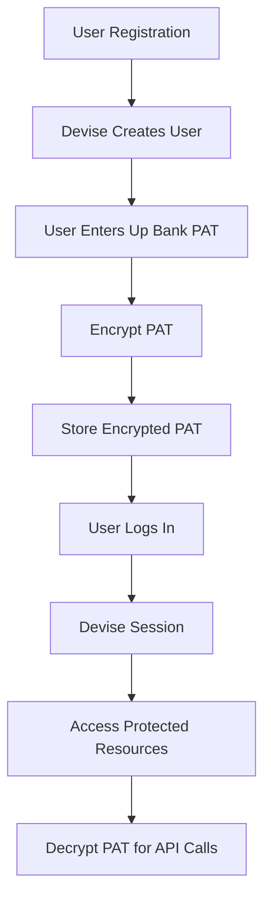

# Security & Authentication
## Devise Setup, PAT Encryption, and Security Best Practices

**Document Version:** 1.1  
**Last Updated:** January 2025  
**Related:** [Backend Architecture](./02-backend-architecture.md)  
**Note:** Requires Rails 8.1.1+ for built-in ActiveRecord encryption

---

## Table of Contents

1. [Authentication Overview](#authentication-overview)
2. [Devise Configuration](#devise-configuration)
3. [PAT Encryption & Storage](#pat-encryption--storage)
4. [Data Security](#data-security)
5. [API Security](#api-security)
6. [Input Validation & Sanitization](#input-validation--sanitization)
7. [Security Headers](#security-headers)
8. [Audit Logging](#audit-logging)

---

## Authentication Overview

### Authentication Architecture



### Security Principles

1. **Encryption at Rest:** All PAT tokens encrypted in database
2. **HTTPS Only:** All connections encrypted in transit
3. **User Isolation:** Each user can only access their own data
4. **Input Validation:** All user input validated and sanitized
5. **Rate Limiting:** API rate limits respected
6. **Audit Logging:** Security events logged

---

## Devise Configuration

### Initial Setup

```ruby
# config/initializers/devise.rb
Devise.setup do |config|
  # Email configuration
  config.mailer_sender = 'noreply@yourdomain.com'
  
  # Password configuration
  config.password_length = 8..128
  
  # Session configuration
  config.sign_out_via = :delete
  
  # Timeout configuration
  config.timeout_in = 30.minutes
  
  # Remember me configuration
  config.remember_for = 2.weeks
  
  # Lock configuration
  config.lock_strategy = :failed_attempts
  config.unlock_strategy = :time
  config.maximum_attempts = 5
  config.unlock_in = 1.hour
end
```

### User Model with Devise

```ruby
# app/models/user.rb
class User < ApplicationRecord
  devise :database_authenticatable, 
         :registerable,
         :recoverable, 
         :rememberable, 
         :validatable,
         :lockable,
         :timeoutable

  # Associations
  has_many :accounts, dependent: :destroy
  has_many :transactions, dependent: :destroy
  has_many :budgets, dependent: :destroy
  has_many :tags, dependent: :destroy
  has_many :investment_goals, dependent: :destroy

  # Encrypted PAT (Rails 8.1.1+ built-in encryption)
  encrypts :up_pat

  # Validations
  validates :email, presence: true, uniqueness: true
  validates :up_pat, presence: true, on: :update, if: :up_pat_changed?

  # Scopes
  scope :with_pat, -> { where.not(up_pat_ciphertext: nil) }

  # Methods
  def up_pat_configured?
    up_pat.present?
  end

  def sync_required?
    last_synced_at.nil? || last_synced_at < 1.hour.ago
  end

  def can_access?(resource)
    resource.user_id == id
  end
end
```

### Routes Configuration

```ruby
# config/routes.rb
Rails.application.routes.draw do
  devise_for :users, controllers: {
    registrations: 'users/registrations',
    sessions: 'users/sessions'
  }

  # Protected routes
  authenticate :user do
    root 'dashboard#index'
    resources :accounts
    resources :transactions
    resources :budgets
    resources :investment_goals
    resources :settings
  end
end
```

### Custom Registration Controller

```ruby
# app/controllers/users/registrations_controller.rb
class Users::RegistrationsController < Devise::RegistrationsController
  before_action :configure_sign_up_params, only: [:create]
  before_action :configure_account_update_params, only: [:update]

  protected

  def configure_sign_up_params
    devise_parameter_sanitizer.permit(:sign_up, keys: [:email, :password, :password_confirmation])
  end

  def configure_account_update_params
    devise_parameter_sanitizer.permit(:account_update, keys: [:email, :password, :password_confirmation, :current_password])
  end

  def after_sign_up_path_for(resource)
    settings_path  # Redirect to settings to enter PAT
  end

  def after_update_path_for(resource)
    settings_path
  end
end
```

---

## PAT Encryption & Storage

### Encryption Setup

**Rails 8.1.1+ Built-in Encryption** - No external gems required.

Rails includes native ActiveRecord encryption using:
- **AES-256-GCM** encryption algorithm
- **Automatic IV and salt management** (no manual handling needed)
- **Built-in key derivation** from Rails credentials
- **Compression** enabled by default

### Encryption Configuration

**Step 1: Generate Encryption Keys**
```bash
# Generate encryption keys (one-time setup)
bin/rails db:encryption:init
```

**Output:**
```
Add this entry to the credentials of the target environment:

active_record_encryption:
  primary_key: EGY8WhulUOXixybod7ZWwMIL68R9o5kC
  deterministic_key: aPA5XyALhf75NNnMzaspW7akTfZp0lPY
  key_derivation_salt: xEY0dt6TZcAMg52K7O84wYzkjvbA62Hz
```

**Step 2: Add Keys to Rails Credentials**
```bash
# Edit credentials (use your preferred editor)
EDITOR="code --wait" rails credentials:edit
```

**Add to `config/credentials.yml.enc`:**
```yaml
# config/credentials.yml.enc
active_record_encryption:
  primary_key: EGY8WhulUOXixybod7ZWwMIL68R9o5kC
  deterministic_key: aPA5XyALhf75NNnMzaspW7akTfZp0lPY
  key_derivation_salt: xEY0dt6TZcAMg52K7O84wYzkjvbA62Hz
```

**Step 3: Enable Encryption in User Model**
```ruby
# app/models/user.rb
class User < ApplicationRecord
  devise :database_authenticatable, :registerable,
         :recoverable, :rememberable, :validatable

  # Rails 8.1.1+ built-in encryption - single line!
  encrypts :up_pat

  has_many :accounts, dependent: :destroy
  has_many :transactions, dependent: :destroy
  has_many :budgets, dependent: :destroy
  has_many :tags, dependent: :destroy
  has_many :investment_goals, dependent: :destroy

  validates :up_pat, presence: true, on: :update, if: :up_pat_changed?,
    format: { 
      with: /\Aup:yeah:[a-zA-Z0-9]+\z/,
      message: "must be a valid Up Bank Personal Access Token"
    }

  def up_pat_configured?
    up_pat.present?
  end

  def sync_required?
    last_synced_at.nil? || last_synced_at < 1.hour.ago
  end

  def can_access?(resource)
    resource.user_id == id
  end
end
```

**How It Works:**
- `encrypts :up_pat` automatically encrypts/decrypts the attribute
- Rails creates a `up_pat_ciphertext` column in the database
- You access it normally: `user.up_pat` (Rails handles encryption transparently)
- No IV, salt, or key management needed in your code

### PAT Storage Migration

**Database Migration:**
```ruby
# db/migrate/XXXXXX_add_encrypted_pat_to_users.rb
class AddEncryptedPatToUsers < ActiveRecord::Migration[8.1]
  def change
    # Rails 8.1.1+ encryption uses single column with _ciphertext suffix
    add_column :users, :up_pat_ciphertext, :text
    add_column :users, :last_synced_at, :datetime
    
    # Index for checking presence (optional)
    add_index :users, :up_pat_ciphertext, 
      where: "up_pat_ciphertext IS NOT NULL",
      name: "index_users_on_encrypted_pat_presence"
  end
end
```

**Important:** 
- Rails automatically looks for the `{attribute}_ciphertext` column
- NO separate IV or salt columns needed (Rails manages internally)
- The column must be named exactly `up_pat_ciphertext`

### PAT Management in Settings

```ruby
# app/controllers/settings_controller.rb
class SettingsController < ApplicationController
  before_action :authenticate_user!

  def show
    @user = current_user
  end

  def update
    @user = current_user

    if params[:user][:up_pat].present?
      # Validate PAT format before saving
      unless valid_pat_format?(params[:user][:up_pat])
        flash[:alert] = "Invalid PAT format. Please check your token."
        render :show, status: :unprocessable_entity
        return
      end

      @user.up_pat = params[:user][:up_pat]
    end

    if @user.save
      # Trigger initial sync
      InitialSyncJob.perform_later(@user.id)
      flash[:notice] = "Settings updated successfully. Syncing your data..."
      redirect_to settings_path
    else
      render :show, status: :unprocessable_entity
    end
  end

  def sync_now
    if current_user.up_pat_configured?
      SyncAccountsJob.perform_later(current_user.id)
      SyncTransactionsJob.perform_later(current_user.id)
      flash[:notice] = "Sync started. This may take a few minutes."
    else
      flash[:alert] = "Please configure your Up Bank PAT first."
    end
    redirect_to settings_path
  end

  private

  def valid_pat_format?(pat)
    pat.to_s.match?(/\Aup:yeah:[a-zA-Z0-9]+\z/)
  end
end
```

### Secure PAT Display

```erb
<!-- app/views/settings/show.html.erb -->
<%= form_with model: @user, url: settings_path, method: :patch do |f| %>
  <div class="form-group">
    <%= f.label :up_pat, "Up Bank Personal Access Token" %>
    <%= f.password_field :up_pat, 
        class: "form-input",
        placeholder: "up:yeah:...",
        value: "" %>
    <p class="form-help">
      Your PAT is encrypted and stored securely. 
      Leave blank to keep current token.
    </p>
  </div>

  <%= f.submit "Update Settings", class: "btn-primary" %>
<% end %>
```

---

## Data Security

### User Data Isolation

```ruby
# app/controllers/application_controller.rb
class ApplicationController < ActionController::Base
  before_action :authenticate_user!

  private

  def ensure_user_owns_resource(resource)
    unless resource.user_id == current_user.id
      raise ActiveRecord::RecordNotFound
    end
  end
end
```

### Scoped Queries

```ruby
# app/controllers/transactions_controller.rb
class TransactionsController < ApplicationController
  def index
    # Always scope to current user
    @transactions = current_user.transactions
      .settled
      .recent
      .includes(:account, :categories, :tags)
      .order(settled_at: :desc)
      .page(params[:page])
  end

  def show
    # Find through user association to ensure ownership
    @transaction = current_user.transactions.find(params[:id])
  end
end
```

### Database-Level Security

```ruby
# Use database constraints
add_foreign_key :accounts, :users, on_delete: :cascade
add_foreign_key :transactions, :users, on_delete: :cascade
add_foreign_key :budgets, :users, on_delete: :cascade

# Add indexes for performance
add_index :transactions, [:user_id, :settled_at]
add_index :accounts, [:user_id, :account_type]
```

### SQL Injection Prevention

```ruby
# ✅ Good: Use ActiveRecord
Transaction.where(user_id: current_user.id)
  .where('settled_at >= ?', params[:start_date])

# ❌ Bad: String interpolation
Transaction.where("user_id = #{current_user.id}")

# ✅ Good: Parameterized queries
Transaction.where("user_id = ? AND settled_at >= ?", 
  current_user.id, params[:start_date])
```

---

## API Security

### Secure API Client

```ruby
# app/services/up_api/client.rb
module UpApi
  class Client
    BASE_URL = 'https://api.up.com.au/api/v1'.freeze

    def initialize(personal_access_token)
      @token = personal_access_token
      validate_token_format!
      @connection = build_connection
    end

    private

    def validate_token_format!
      unless @token.to_s.match?(/\Aup:yeah:[a-zA-Z0-9]+\z/)
        raise ArgumentError, "Invalid PAT format"
      end
    end

    def build_connection
      Faraday.new(url: BASE_URL) do |conn|
        conn.request :json
        conn.response :json
        conn.adapter Faraday.default_adapter
        
        # Security headers
        conn.headers['Authorization'] = "Bearer #{@token}"
        conn.headers['Content-Type'] = 'application/json'
        conn.headers['User-Agent'] = 'UpBankDesktop/1.0'
        
        # SSL verification
        conn.ssl.verify = true
        conn.ssl.verify_mode = OpenSSL::SSL::VERIFY_PEER
      end
    end
  end
end
```

### Rate Limit Handling

```ruby
# app/services/up_api/client.rb
def handle_response(response)
  # Check rate limit headers
  remaining = response.headers['X-RateLimit-Remaining']&.to_i
  limit = response.headers['X-RateLimit-Limit']&.to_i
  
  Rails.logger.info "Rate limit: #{remaining}/#{limit} remaining" if remaining

  case response.status
  when 200..299
    response.body
  when 429
    retry_after = response.headers['Retry-After']&.to_i || 60
    raise UpApi::RateLimitError.new(
      "Rate limit exceeded",
      429,
      { retry_after: retry_after }
    )
  when 401
    raise UpApi::AuthenticationError, "Invalid or expired token"
  else
    raise UpApi::ApiError, "API error: #{response.status}"
  end
end
```

---

## Input Validation & Sanitization

### Model Validations

```ruby
# app/models/budget.rb
class Budget < ApplicationRecord
  belongs_to :user
  belongs_to :category, optional: true

  validates :name, 
    presence: true,
    length: { maximum: 255 },
    format: { without: /[<>]/, message: "cannot contain HTML tags" }

  validates :amount, 
    presence: true,
    numericality: { 
      greater_than: 0,
      less_than_or_equal_to: 1_000_000_000  # $1 billion max
    }

  validates :period, 
    inclusion: { in: %w[monthly weekly yearly] }

  validates :alert_threshold,
    numericality: { in: 0..100 }

  # Ensure user owns the category if specified
  validate :category_belongs_to_user

  private

  def category_belongs_to_user
    return unless category_id
    
    # Categories are shared, but validate it exists
    unless Category.exists?(category_id)
      errors.add(:category_id, "does not exist")
    end
  end
end
```

### Controller Parameter Sanitization

```ruby
# app/controllers/budgets_controller.rb
class BudgetsController < ApplicationController
  before_action :set_budget, only: [:show, :edit, :update, :destroy]

  def create
    @budget = current_user.budgets.build(budget_params)
    
    if @budget.save
      redirect_to budgets_path, notice: "Budget created successfully"
    else
      render :new, status: :unprocessable_entity
    end
  end

  private

  def budget_params
    params.require(:budget).permit(
      :name,
      :amount,
      :period,
      :category_id,
      :start_date,
      :end_date,
      :alert_threshold
    )
  end

  def set_budget
    @budget = current_user.budgets.find(params[:id])
  end
end
```

### XSS Prevention

```erb
<!-- ✅ Good: Rails auto-escapes -->
<%= transaction.description %>

<!-- ✅ Good: Explicit escaping -->
<%= sanitize(user_input, tags: []) %>

<!-- ❌ Bad: raw/html_safe without sanitization -->
<%= raw(user_input) %>
```

---

## Security Headers

### Rails Security Configuration

```ruby
# config/application.rb
config.force_ssl = true  # Force HTTPS in production
config.session_store :cookie_store, 
  key: '_up_bank_session',
  httponly: true,
  secure: Rails.env.production?,
  same_site: :lax

# Content Security Policy
config.content_security_policy do |policy|
  policy.default_src :self, :https
  policy.font_src    :self, :https, :data
  policy.img_src     :self, :https, :data
  policy.object_src  :none
  policy.script_src  :self, :https
  policy.style_src    :self, :https
  policy.connect_src  :self, 'https://api.up.com.au'
end

# Report CSP violations
config.content_security_policy_report_only = false
```

### Additional Security Headers

```ruby
# config/initializers/security_headers.rb
Rails.application.config.force_ssl = true

Rails.application.config.action_dispatch.default_headers.merge!(
  'X-Frame-Options' => 'DENY',
  'X-Content-Type-Options' => 'nosniff',
  'X-XSS-Protection' => '1; mode=block',
  'Referrer-Policy' => 'strict-origin-when-cross-origin',
  'Permissions-Policy' => 'geolocation=(), microphone=(), camera=()'
)
```

---

## Audit Logging

### Security Event Logging

```ruby
# app/models/concerns/auditable.rb
module Auditable
  extend ActiveSupport::Concern

  included do
    after_create :log_create
    after_update :log_update
    after_destroy :log_destroy
  end

  private

  def log_create
    SecurityLog.create!(
      user_id: current_user&.id,
      action: 'create',
      resource_type: self.class.name,
      resource_id: id,
      ip_address: Current.request&.remote_ip,
      user_agent: Current.request&.user_agent
    )
  end

  def log_update
    SecurityLog.create!(
      user_id: current_user&.id,
      action: 'update',
      resource_type: self.class.name,
      resource_id: id,
      changes: saved_changes,
      ip_address: Current.request&.remote_ip
    )
  end

  def log_destroy
    SecurityLog.create!(
      user_id: current_user&.id,
      action: 'destroy',
      resource_type: self.class.name,
      resource_id: id,
      ip_address: Current.request&.remote_ip
    )
  end
end
```

### Security Log Model

```ruby
# app/models/security_log.rb
class SecurityLog < ApplicationRecord
  belongs_to :user, optional: true

  enum action: {
    create: 'create',
    update: 'update',
    destroy: 'destroy',
    login: 'login',
    logout: 'logout',
    failed_login: 'failed_login',
    pat_updated: 'pat_updated',
    sync_started: 'sync_started',
    sync_failed: 'sync_failed'
  }

  scope :recent, -> { order(created_at: :desc).limit(100) }
  scope :for_user, ->(user_id) { where(user_id: user_id) }
end
```

### Logging Failed Authentication

```ruby
# app/controllers/users/sessions_controller.rb
class Users::SessionsController < Devise::SessionsController
  def create
    user = User.find_by(email: params[:user][:email])
    
    if user && user.valid_password?(params[:user][:password])
      SecurityLog.create!(
        user: user,
        action: 'login',
        ip_address: request.remote_ip,
        user_agent: request.user_agent
      )
      super
    else
      SecurityLog.create!(
        user: user,
        action: 'failed_login',
        ip_address: request.remote_ip,
        user_agent: request.user_agent
      )
      super
    end
  end

  def destroy
    SecurityLog.create!(
      user: current_user,
      action: 'logout',
      ip_address: request.remote_ip
    )
    super
  end
end
```

---

## Best Practices Summary

### ✅ Do

- Encrypt all sensitive data (PAT tokens)
- Use HTTPS everywhere
- Validate and sanitize all user input
- Scope all queries to current user
- Log security events
- Use parameterized queries
- Implement rate limiting
- Use strong passwords (Devise default)
- Enable CSRF protection (Rails default)
- Set secure HTTP headers

### ❌ Don't

- Store PAT tokens in plain text
- Trust user input without validation
- Expose user data across users
- Log sensitive data (PATs, passwords)
- Use string interpolation in SQL
- Disable SSL in production
- Skip authentication checks
- Store sensitive data in cookies
- Expose internal errors to users
- Allow unlimited API requests

---

**Document Version:** 1.1  
**Last Updated:** January 2025